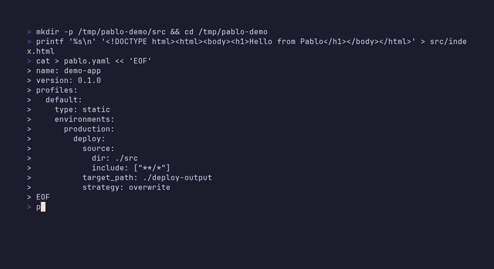

# Pablo

CLI deployment helper for local and remote (SSH) environments — build, filter, and deploy from a single YAML manifest (`pablo.yaml`).



**Docs:** [docs/](docs/README.md) · **Releases:** [GitHub Releases](https://github.com/septillioner/pablo/releases) · **Changelog:** [CHANGELOG.md](CHANGELOG.md)

---

## Table of contents

- [Why Pablo?](#why-pablo)
- [Features](#features)
- [Requirements](#requirements)
- [Installation](#installation)
- [Getting started](#getting-started)
- [CLI](#cli)
- [Deployment types](#deployment-types)
- [Editor support](#editor-support)
- [Documentation](#documentation)
- [Contributing](#contributing)
- [License](#license)

---

## Why Pablo?

Pablo is for solo developers and small teams who deploy to their own server over SSH and do not want to stand up a full CI/CD pipeline. You keep one binary and one YAML manifest; VS Code and Visual Studio get completion, validation, and CodeLens Run via an embedded LSP — uncommon in this niche.

It is not a replacement for Ansible, rsync-only workflows, or GitHub Actions. Use those when you need configuration management fleets, pure file sync, or push-triggered cloud CI. Use Pablo when you want push-to-deploy simplicity from your laptop (or a minimal runner) with build, filter, and remote deploy in one place.

---

## Features

- **Multi-profile manifests** — frontend, backend, and infra in one `pablo.yaml`
- **Full deploy pipeline** — optional build, filter, deploy, templates, pre/post commands
- **Local and remote SSH** — tar-streamed transfers for bulk deploys
- **Four deployment types** — `static`, `binary`, `docker`, `git-sync`
- **Deploy strategies** — `overwrite`, `backup`, `recreate`, `rename-replace` (with rollback where supported)
- **Safety** — protected path detection and backup/rollback on failure
- **Self-update** — `pablo update` from GitHub Releases
- **Editor tooling** — VS Code and Visual Studio extensions with LSP (completion, validation, Run)

---

## Requirements

| Component | When needed |
|-----------|-------------|
| **Go 1.25.5+** | Building from source only |
| **Git** | `git-sync` and `docker` types |
| **Docker** | `docker` type |
| **OpenSSH client** | Remote SSH deploys |

Supported hosts: **Windows**, **macOS**, **Linux**.

---

## Installation

### One-liner (recommended)

Downloads the latest release, verifies the SHA-256 checksum, and installs to a system or user path.

**Windows (PowerShell):**

```powershell
$s="$env:TEMP\pablo-install.ps1"; [Net.ServicePointManager]::SecurityProtocol=[Net.SecurityProtocolType]::Tls12; irm 'https://raw.githubusercontent.com/septillioner/pablo/master/scripts/install.ps1' -OutFile $s; powershell -NoProfile -ExecutionPolicy Bypass -File $s
```

**Windows (cmd):**

```bat
curl -fsSL https://raw.githubusercontent.com/septillioner/pablo/master/scripts/install.cmd -o install.cmd && install.cmd
```

**macOS / Linux:**

```bash
curl -fsSL https://raw.githubusercontent.com/septillioner/pablo/master/scripts/install.sh | bash
```

Pin a version with `PABLO_VERSION=v1.5.6` (or `$env:PABLO_VERSION` on Windows) before running the installer.

### Other options

| Method | How |
|--------|-----|
| Pre-built binary | Download from [Releases](https://github.com/septillioner/pablo/releases), verify `checksums.txt`, put on `PATH` |
| Build from source | `git clone` → `./scripts/build.sh` → `./build/pablo` |
| Update existing install | `pablo update` · `pablo update --check` |

Verify:

```bash
pablo version
```

Full instructions: [Installation](docs/getting-started/installation.md)

---

## Getting started

```bash
pablo init                 # sample manifest (or: pablo init --template)
pablo check                # validate
pablo run                  # defaults: profile default, env production
# or: pablo run default/production
# or: pablo run -p default -e production
# or: pablo run sequence release   # named multi-target sequence
```

Simplest useful case: `type: static` with `deploy.source` and no `build` — copy files as-is.

```yaml
name: my-app
version: 0.1.0

profiles:
  default:
    type: static
    environments:
      production:
        deploy:
          source:
            dir: ./src
            include: ["**/*"]
          target_path: ./deploy-output
          strategy: overwrite
```

| Next step | Link |
|-----------|------|
| Full walkthrough | [Quick start](docs/getting-started/quick-start.md) |
| Step-by-step first deploy | [First deployment](docs/getting-started/first-deployment.md) |
| Progressive samples | [Examples](docs/examples/README.md) |

---

## CLI

| Command | Description |
|---------|-------------|
| `pablo run [profile/env]` | Run the deploy pipeline (`-p` / `-e` / `-f` / `--force`) |
| `pablo run sequence <name>` | Run a named ordered sequence of `profile/env` targets |
| `pablo check` | Validate a manifest |
| `pablo inspect` | List profiles, environments, and sequences (`--json`) |
| `pablo init` | Generate a sample (`-t` / `--template` wizard) |
| `pablo uninstall` | Remove deploy dir and PATH entries |
| `pablo update` | Update CLI from GitHub Releases |
| `pablo version` | Print version |
| `pablo lsp` | Language server (stdio; used by editors) |

Defaults: manifest `pablo.yaml`, profile `default`, environment `production`.

Full reference: [CLI](docs/reference/cli.md)

---

## Deployment types

| Type | Description | Local | Remote SSH |
|------|-------------|-------|------------|
| `static` | Files / SPA — `build` optional | Yes | Yes |
| `binary` | Executables + PATH registration | Yes | Yes |
| `docker` | Git sync + Docker Compose | Yes | Yes |
| `git-sync` | Git pull + post commands | Yes | Yes |

Details and limitations: [Capabilities](docs/reference/capabilities.md)

---

## Editor support

| Editor | Install | Docs |
|--------|---------|------|
| **VS Code** | Marketplace: **Pablo** (`septillioner.pablo`), or `.vsix` from Releases | [VS Code guide](docs/guides/vscode.md) |
| **Visual Studio** | `pablo-vs2026-*.vsix` from Releases (VS 2022 / 2026) | [Visual Studio guide](docs/guides/visual-studio.md) |

Both use `pablo lsp` for completion, hover, validation, and Run (CodeLens / tool window / toolbar).

---

## Documentation

| Section | Pages |
|---------|-------|
| Getting started | [Installation](docs/getting-started/installation.md) · [Quick start](docs/getting-started/quick-start.md) · [First deployment](docs/getting-started/first-deployment.md) · [Project structure](docs/getting-started/project-structure.md) |
| Examples | [Sixteen scenarios](docs/examples/README.md) — local → SSH → Docker → git-sync → sequences → Windows |
| Guides | [Sequences](docs/guides/sequences.md) · [SSH](docs/guides/ssh.md) · [Docker](docs/guides/docker.md) · [Credentials](docs/guides/credentials.md) · [Strategies](docs/guides/deploy-strategies.md) · [Git sync](docs/guides/git-sync.md) · [Binary / PATH](docs/guides/binary-and-path.md) |
| Reference | [CLI](docs/reference/cli.md) · [Configuration](docs/reference/configuration.md) · [Capabilities](docs/reference/capabilities.md) · [API](docs/reference/api.md) |
| More | [FAQ](docs/faq.md) · [Troubleshooting](docs/troubleshooting.md) · [Roadmap](docs/roadmap.md) · [Full index](docs/README.md) |

---

## Contributing

See [CONTRIBUTING.md](CONTRIBUTING.md) and [docs/development/contributing.md](docs/development/contributing.md).

**Security:** report vulnerabilities per [SECURITY.md](SECURITY.md) — do not open public issues for security reports.

**Releasing:** [Release process](docs/development/release-process.md)

---

## License

Apache License 2.0 — see [LICENSE](LICENSE).

## Author

**Ege Ismail Kosedag** · [github.com/septillioner](https://github.com/septillioner)
