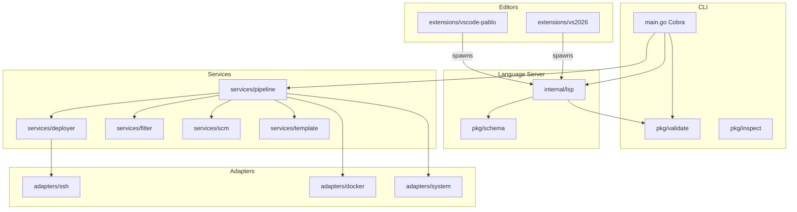
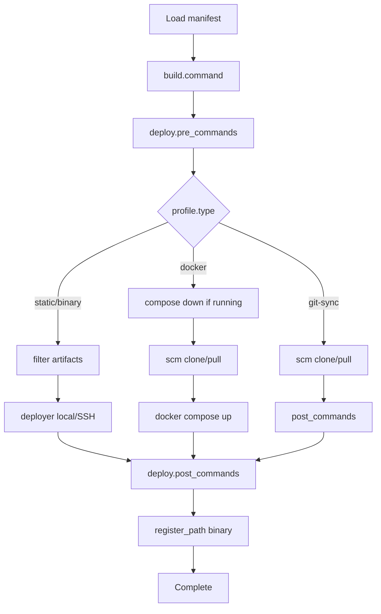

# Architecture

High-level overview of Pablo’s components and deployment pipeline.

For the maintainer/agent internal map, see [PMAP.md](../../PMAP.md) (gitignored).

---

## Components



| Layer | Location | Responsibility |
|-------|----------|----------------|
| CLI | `src/main.go` | Cobra commands, dependency injection |
| Domain | `src/pkg/domain/` | Config, Profile, Environment types |
| Config | `src/pkg/config/` | YAML loading, profile→environment inheritance |
| Validation | `src/pkg/validate/` | Semantic schema rules (CLI + LSP) |
| Services | `src/internal/services/` | Pipeline orchestration and business logic |
| Adapters | `src/internal/adapters/` | SSH, Docker, OS PATH integration |
| LSP | `src/internal/lsp/` | glsp stdio language server |
| Extensions | `extensions/vscode-pablo/`, `extensions/vs2026/` | Editor integration |

**Go module:** `pablo` · **Minimum Go:** 1.25.5 · **Version:** embedded from `src/VERSION`

---

## Pipeline flow

Orchestrator: `src/internal/services/pipeline/service.go`



`pablo run sequence <name>` loads the manifest, resolves `sequences.<name>`, and calls the single-target pipeline for each `profile/env` step in list order, aborting on the first error.

### Profile types

| Type | Flow |
|------|------|
| `static` | Optional build → filter → deploy files |
| `binary` | Build → filter → deploy → PATH registration |
| `docker` | Optional compose down if running → Git clone/pull → env file → docker compose |
| `git-sync` | Git clone/pull → env file → post commands |

---

## Services

| Service | Path | Role |
|---------|------|------|
| pipeline | `services/pipeline/` | Full lifecycle orchestration (`Run`, `RunSequence`) |
| deployer | `services/deployer/` | Local copy, SSH tar stream, protected paths |
| filter | `services/filter/` | Gitignore-style include/exclude globs |
| scm | `services/scm/` | Git clone/pull |
| template | `services/template/` | `{{VAR}}` substitution |
| hooks | `services/hooks/` | Run `pre_commands` / `post_commands` shells |
| builder | `services/builder/` | Unused — builds run inline in pipeline |

---

## Adapters

| Adapter | Role |
|---------|------|
| `ssh` | Connection, SCP, tar streaming, remote commands |
| `docker` | `docker compose up/down`; running-stack probe for redeploy precheck |
| `system` | Cross-platform PATH register/remove |

---

## Config inheritance

```
Config
├── credentials
├── sequences          (optional — named ordered profile/env lists)
└── profiles
    └── Profile (type, variables, env_file, build, git)
        └── environments
            └── Environment (deploy, remote, register_path, variables, env_file, build?)
```

Rules in `src/pkg/config/loader.go`:

- Profile `variables` / `env_file` / `build` → environment (partial merge for `build`, including `build.variables` / `build.env_file`)
- `deploy.source`, `deploy.target_path`, and `remote` are always explicit on the environment

Env files are write-only from YAML maps (`pipeline.handleBuild` / deploy paths). Canonical values live in environment `variables`; `resolveBuildVariables` overlays optional `build.variables` for the pre-build file and build process env. See [Configuration — Variables and env files](../reference/configuration.md#variables-and-env-files).

---

## Domain shape

Three nouns map to domain types in `pkg/domain/models.go`:

| Noun | Type | Key fields |
|------|------|------------|
| Profile | `Profile` | `type`, `variables`, `env_file`, `build`, `git`, `environments` |
| Environment | `Environment` | `deploy`, `remote`, `variables`, `env_file`, `build`, `register_path` |
| Deploy | `DeployConfig` | `source`, `target_path`, `strategy`, `transfer`, `verify_checksum`, `pre_commands`, `post_commands`, `docker` |

Type gates are enforced in `pkg/validate/validate.go`.

---

## Build and self-deploy

| Script | Output |
|--------|--------|
| `scripts/build.sh` | `build/pablo[.exe]` |
| `scripts/build.sh all` | `build/pablo-{os}-{arch}[.exe]` |
| `scripts/test.sh` / `scripts/test.ps1` / `scripts/test.bat` | Unit, integration, and E2E test runner |

Release orchestration manifest: `pablo-sepy.yaml`

---

## Related

- [Testing](testing.md)
- [Configuration reference](../reference/configuration.md)
- [Capabilities](../reference/capabilities.md)
