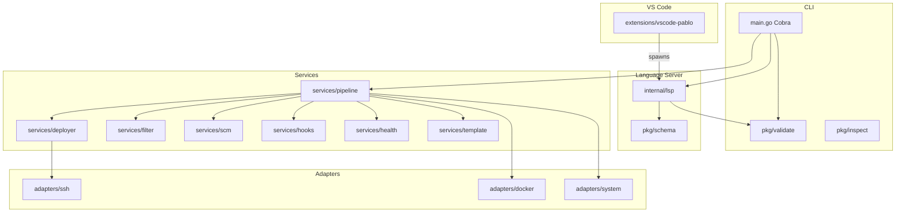
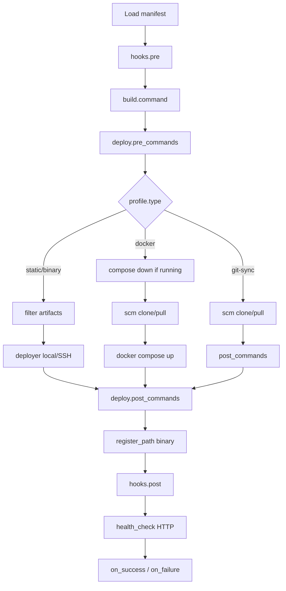

# Architecture

High-level overview of Pablo's components and deployment pipeline.

For the maintainer/agent internal map (Turkish), see [PMAP.md](../../PMAP.md).

---

## Components



| Layer | Location | Responsibility |
|-------|----------|----------------|
| CLI | `src/main.go` | Cobra commands, dependency injection |
| Domain | `src/pkg/domain/` | Config, Profile, Environment types |
| Config | `src/pkg/config/` | YAML loading, profile→environment inheritance |
| Validation | `src/pkg/validate/` | Semantic schema rules (CLI + LSP) |
| Services | `src/internal/services/` | Pipeline orchestration and business logic |
| Adapters | `src/internal/adapters/` | SSH, Docker, OS PATH integration |
| LSP | `src/internal/lsp/` | glsp stdio language server |
| Extension | `extensions/vscode-pablo/` | Editor integration |

**Go module:** `pablo` · **Minimum Go:** 1.25.5 · **Version:** embedded from `src/VERSION`

---

## Pipeline flow

Orchestrator: `src/internal/services/pipeline/service.go`



`pablo run sequence <name>` loads the manifest, resolves `sequences.<name>`, and calls the single-target pipeline for each `profile/env` step **in list order**, aborting on the first error.

### Profile types

| Type | Flow |
|------|------|
| `static` | Build → filter → deploy files |
| `binary` | Build → deploy → PATH registration |
| `docker` | Optional compose down if running → Git clone/pull → env file → docker compose |
| `git-sync` | Git clone/pull → env file → post commands |

---

## Services

| Service | Path | Role |
|---------|------|------|
| pipeline | `services/pipeline/` | Full lifecycle orchestration (`Run`, `RunSequence`) |
| deployer | `services/deployer/` | Local copy, SSH tar stream, protected paths |
| filter | `services/filter/` | Gitignore-style include/exclude globs |
| scm | `services/scm/` | Git clone/pull |
| hooks | `services/hooks/` | Shell/PowerShell hooks |
| health | `services/health/` | HTTP GET with 30s retry |
| template | `services/template/` | `{{VAR}}` substitution |
| builder | `services/builder/` | **Unused** — builds run inline in pipeline |

---

## Adapters

| Adapter | Role |
|---------|------|
| `ssh` | Connection, SCP, tar streaming, remote commands |
| `docker` | `docker compose up/down`; running-stack probe for redeploy precheck |
| `system` | Cross-platform PATH register/remove |

---

## Config inheritance

```
Config
├── credentials
├── sequences          (optional — named ordered profile/env lists)
└── profiles
    └── Profile (type, build, output_dir, git, hooks, pipeline)
        └── environments
            └── Environment (deploy, remote, register_path)
```

Rules in `src/pkg/config/loader.go`:

- Profile `variables` / `env_file` → environment
- Profile `build` → environment (overridable)
- Profile `output_dir` → `env.deploy.source` when no source set
- Legacy top-level `type` → wrapped as `profiles.default`

---

## Build and self-deploy

| Script | Output |
|--------|--------|
| `build.sh` | `build/pablo[.exe]` |
| `build.sh all` | `build/pablo-{os}-{arch}[.exe]` |
| `test.sh` / `test.ps1` / `test.bat` | Unit, integration, and E2E test runner |

Release orchestration manifest: `pablo-sepy.yaml`

---

## Related

- [Testing](testing.md)
- [Configuration reference](../reference/configuration.md)
- [Capabilities](../reference/capabilities.md)
