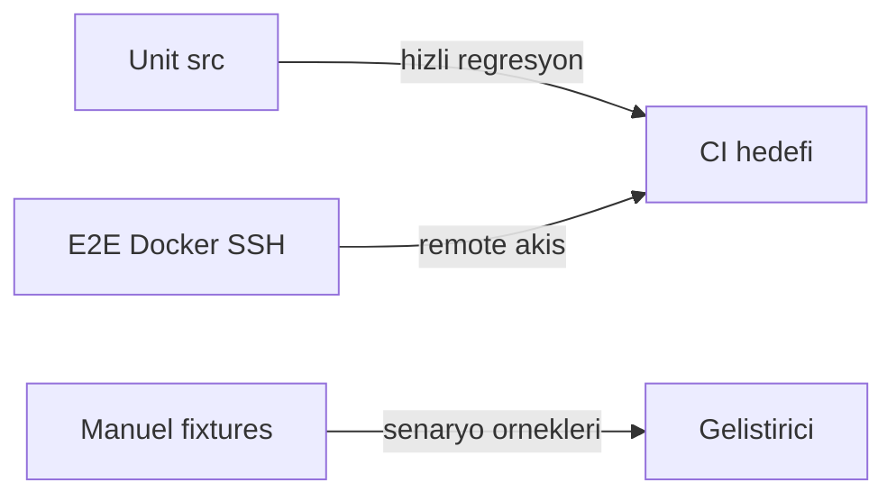

# TEST_PLAN — Pablo Test Stratejisi

Bu belge **nasıl** test edildiğini anlatır. Hangi testin neyi doğruladığı için bkz. [TEST_SPEC.md](TEST_SPEC.md). Backlog için bkz. [../goals.md](../goals.md).

---

## Katmanlar

| Katman | Konum | Amaç | Gereksinim |
|--------|-------|------|------------|
| **Unit** | `src/**/*_test.go` | Paket mantığı; ağ/daemon yok | Go 1.25.5+ |
| **E2E** | `tests/e2e/` | Gerçek SSH + uzak docker (Ubuntu container) | Docker, `ssh-keygen` |
| **Manuel fixture** | `tests/agnostic/`, `tests/windows/` | YAML senaryoları; elle `pablo check` / `run` | Derlenmiş `pablo` veya `go run` |



---

## Komutlar

### Unit (her degisiklikten sonra)

```bash
cd src
go test ./...
```

### E2E (remote SSH / docker)

```bash
cd tests/e2e
go test -tags=integration -v -timeout 10m ./...
```

### Manuel fixture

```bash
# Manifest dogrulama
go run ./src/main.go check -f tests/agnostic/local-deploy/pablo.yaml

# Deploy (dikkat: gercek dosya kopyalar)
cd tests/agnostic/local-deploy
go run ../../../src/main.go run -e production
```

---

## Kapsam matrisi (sistem → katman)

| Sistem | Unit | E2E | Manuel fixture |
|--------|------|-----|----------------|
| Config / kalitim | x | | x |
| Artifact filter | x | | |
| Remote path (pathutil) | x | | |
| Template `{{VAR}}` | x | | |
| Deployer / stratejiler | x | | |
| Health check HTTP | x | | |
| Hooks | x | | |
| PATH (system adapter) | x | | x (windows) |
| SSH adapter | x | x | |
| Pipeline helpers | x | | |
| SCM (git) | x | x | x |
| Docker adapter | x | x | x |
| Tam pipeline `Run` | | x | x |

---

## Kurallar

1. Yeni unit test: `src/internal/.../foo_test.go` — test edilen paketle ayni dizin.
2. Ag gerektiren unit test yazma; remote davranis E2E'de.
3. Yeni test eklendiginde [TEST_SPEC.md](TEST_SPEC.md) guncellenir.
4. `goals.md` backlog tamamlaninca SPEC'te `done` isaretlenir.
5. SCM unit testleri `git` CLI kullanir; yoksa test `Skip`.

---

## CI hedefi (henuz yok)

- PR: `cd src && go test ./...`
- Opsiyonel job: `cd tests/e2e && go test -tags=integration ./...` (Docker runner)
- Coverage: `go test -coverprofile=coverage.out ./...`

---

## Dizin haritasi

```
tests/
├── TEST_PLAN.md      # bu dosya
├── TEST_SPEC.md      # test katalogu
├── README.md         # kisa indeks
├── e2e/              # integration (Go + Docker)
├── agnostic/         # manuel YAML ornekleri
└── windows/          # Windows ozel fixture
```
